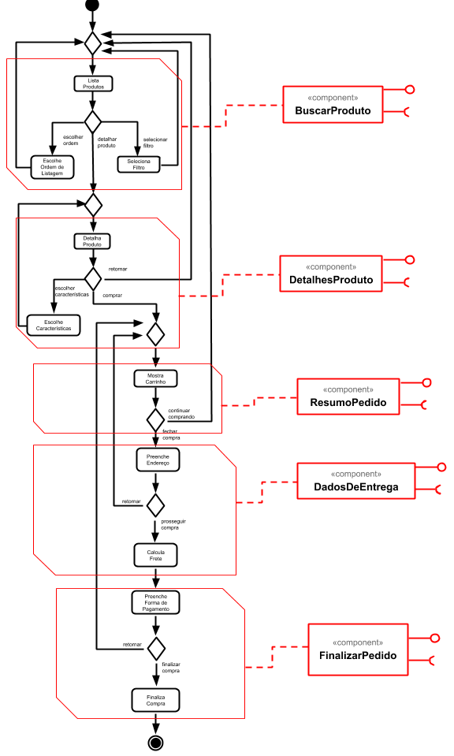
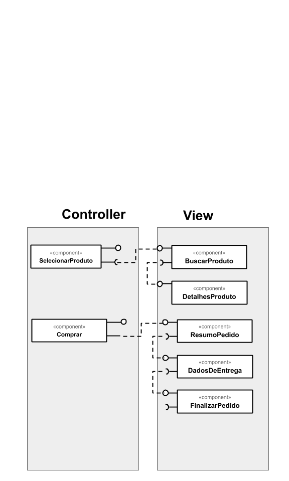
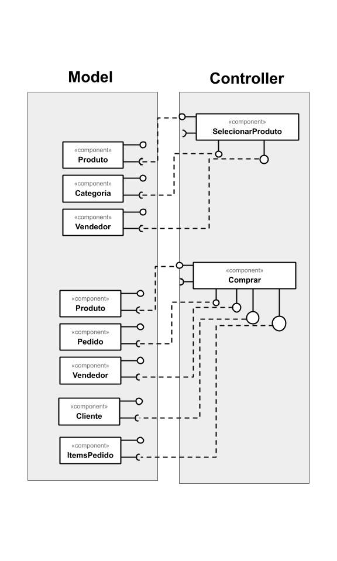

# Lab04 - Serviços

## Tarefa 1

## Tarefa 2

## Tarefa 3

## Tarefa 4
### Serviço `Current Weather`
* **Título do serviço:** `Current weather data`
* **Breve descrição:**
  API que disponibiliza o clima atual com base na Longitude e latitude.
* **URL da requisição:** `api.openweathermap.org/data/2.5/weather?lat=35&lon=139`

* **Cabeçalho chamada**:
~~~http
:method: GET
:scheme: https
accept: text/html,application/xhtml+xml,application/xml;q=0.9,image/webp,image/apng,*/*;q=0.8,application/signed-exchange;v=b3
accept-encoding: gzip, deflate, br
accept-language: pt-BR,pt;q=0.9,en-US;q=0.8,en;q=0.7
cache-control: no-cache
cookie: __cfduid=dce412b5cb7a1be046df8fb94506a26fa1598289065; _ga=GA1.2.1278844842.1598289091; _gid=GA1.2.1274851064.1598289091; _hjid=691bff5e-350f-44d6-8780-1497cae4e536; _hjAbsoluteSessionInProgress=0; _gat=1
pragma: no-cache
sec-fetch-mode: navigate
sec-fetch-site: none
upgrade-insecure-requests: 1
user-agent: Chrome/77.0.3865.90 Safari/537.36
~~~

* **Cabeçalho da resposta**:

~~~http
access-control-allow-credentials: true
access-control-allow-headers: dnt,x-customheader,keep-alive,user-agent,x-requested-with,if-modified-since,cache-control,content-type
access-control-allow-methods: get, post, options
access-control-allow-origin: *
cache-control: max-age=1800
cf-cache-status: MISS
cf-ray: 5c7ee0c02bac09f0-GIG
cf-request-id: 04c32acc16000009f0d6936200000001
content-encoding: br
content-language: canon
content-type: application/json; charset=utf-8
date: Mon, 27 Aug 2020 20:43:51 GMT
etag: W/"1a0a-3qGPt3ldfF3mZ8zfcHIw3s4Tm4A"
expect-ct: max-age=604800, report-uri="https://report-uri.cloudflare.com/cdn-cgi/beacon/expect-ct"
server: cloudflare
status: 200
vary: Accept-Encoding
x-cache-status: HIT
x-powered-by: Express
~~~

* **Resposta**:
~~~json
{"coord": { "lon": 139,"lat": 35},
  "weather": [
    {
      "id": 800,
      "main": "Clear",
      "description": "clear sky",
      "icon": "01n"
    }
  ],
  "base": "stations",
  "main": {
    "temp": 281.52,
    "feels_like": 278.99,
    "temp_min": 280.15,
    "temp_max": 283.71,
    "pressure": 1016,
    "humidity": 93
  },
  "wind": {
    "speed": 0.47,
    "deg": 107.538
  },
  "clouds": {
    "all": 2
  },
  "dt": 1560350192,
  "sys": {
    "type": 3,
    "id": 2019346,
    "message": 0.0065,
    "country": "JP",
    "sunrise": 1560281377,
    "sunset": 1560333478
  },
  "timezone": 32400,
  "id": 1851632,
  "name": "Shuzenji",
  "cod": 200
}
~~~

### Serviço `Currency Convert Api`
* **Título do serviço:** `Currency Convert Api`
* **Breve descrição:**
  Oferece um web service gratuito para desenvolvedores para converter uma moeda para outra. É gratuíto para uso em aplicações pessoais e comerciais, porém seu uso não oferece nenhuma garantia.
* **URL da requisição:** `https://free.currconv.com/api/v7/convert?q=USD_BRL&compact=ultra&date=2020-03-06&endDate=2020-03-14&apiKey=c7649b3bcabec4b60d5d`

* **Cabeçalho chamada**:
~~~http
:method: GET
:scheme: https
accept: text/html,application/xhtml+xml,application/xml;q=0.9,image/webp,image/apng,*/*;q=0.8,application/signed-exchange;v=b3
accept-encoding: gzip, deflate, br
accept-language: pt-BR,pt;q=0.9,en-US;q=0.8,en;q=0.7
cache-control: no-cache
cookie: __cfduid=dce412b5cb7a1be046df8fb94506a26fa1598289065; _ga=GA1.2.1278844842.1598289091; _gid=GA1.2.1274851064.1598289091; _hjid=691bff5e-350f-44d6-8780-1497cae4e536; _hjAbsoluteSessionInProgress=0; _gat=1
pragma: no-cache
sec-fetch-mode: navigate
sec-fetch-site: none
upgrade-insecure-requests: 1
user-agent: Chrome/77.0.3865.90 Safari/537.36
~~~

* **Cabeçalho da resposta**:

~~~http
access-control-allow-headers → Origin, X-Requested-With, Content-Type, Accept
access-control-allow-origin → *
cf-cache-status → DYNAMIC
cf-ray → 5c9a28a43944cff0-GRU
cf-request-id → 04d437baa10000cff05821f200000001
content-encoding → br
content-type → application/json; charset=utf-8
date → Fri, 28 Aug 2020 01:11:31 GMT
etag → W/"d2-TWXBBjSabS/3qg2ZhbdljB0BUJA"
expect-ct → max-age=604800, report-uri="https://report-uri.cloudflare.com/cdn-cgi/beacon/expect-ct"
server → cloudflare
status → 200
x-content-type-options → nosniff
x-powered-by → Express
~~~

* **Resposta**:
~~~json
{
	"USD_BRL": {
    	"2020-03-06": 4.62665,
    	"2020-03-07": 4.627304,
    	"2020-03-08": 4.627301,
    	"2020-03-09": 4.724403,
    	"2020-03-10": 4.643602,
    	"2020-03-11": 4.815298,
    	"2020-03-12": 4.791703,
    	"2020-03-13": 4.859604,
    	"2020-03-14": 4.859604
	}
}

~~~