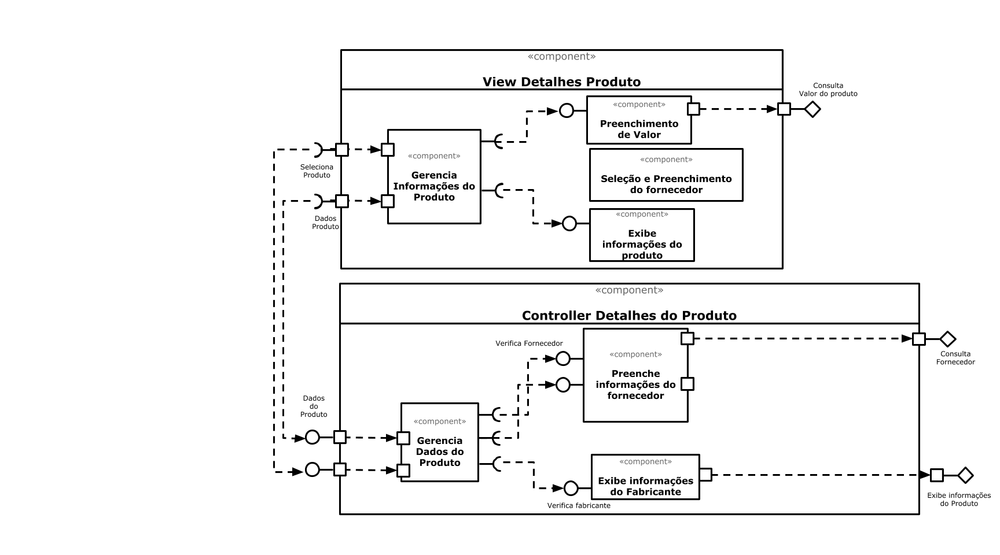

# Lab05 - Subcomponentes e Páginas Dinâmicas

## Tarefa 1

## Tarefa 2
Projeto no Codepen: [subcomponentes](https://codepen.io/assouza22/pen/ZEWaNWj)

**HTML**
~~~html

~~~

**JavaScript**
~~~javascript
class Barra extends React.Component {
  render() {
    let resultado = "";
    for (let b = 1; b <= this.props.tamanho; b++)
      resultadclass Barra extends React.Component {
  render() {
    let resultado = "";
    for (let b = 1; b <= this.props.tamanho; b++)
      resultado += "=";
    return resultado;
  }
}

class AnimalOptions extends React.Component {
  constructor(props) {
    super(props);
    this.state = {animal: ''};
    this.handleChange = this.handleChange.bind(this);  
  }
  
  handleChange(event) {
    this.setState({animal: event.target.value});
  }
  
  render() {
    return (
      

        <select onChange={this.handleChange}>
          <option value="">Selecione um animal</option>
          <option value="Leão">Leão</option>
          <option value="Cachorro">Cachorro</option>
          <option value="Macaco">Macaco</option>
        </select>
        {
          this.state.animal !== '' && 
            <OptionSelected animal={this.state.animal}/>  
        }
      

    )
  }
}

class ActionOptions extends React.Component {
  constructor(props) {
    super(props) ;
    this.state = {action: ''};
    this.handleActionChange = this.handleActionChange.bind(this);  
  }
  
  handleActionChange(event) {
    this.setState({action: event.target.value});
  }
  
  render() {
    return (
      

        <select onChange={this.handleActionChange}>
          <option value="">Selecione uma ação</option>
          <option value="Pulou a lama">Pulou a lama</option>
          <option value="Comeu abelha">Comeu abelha</option>
          <option value="Caçou de noite">Caçou de noite</option>
        </select>
        {
          this.state.action !== '' &&
            <OptionSelected action={this.state.action}/>  
        }
      

    )
  }
}
  
function OptionSelected({animal,action}) {
  return (
    

      <h2>O {animal}</h2>
      <Barra tamanho="10"/>
      <h2>{action}</h2>
    

  )  
}

const elemento = 
                
                   <AnimalOptions /> 
       <ActionOptions /> 
                 

ReactDOM.render(elemento, 
        document.getElementById("root"));
~~~